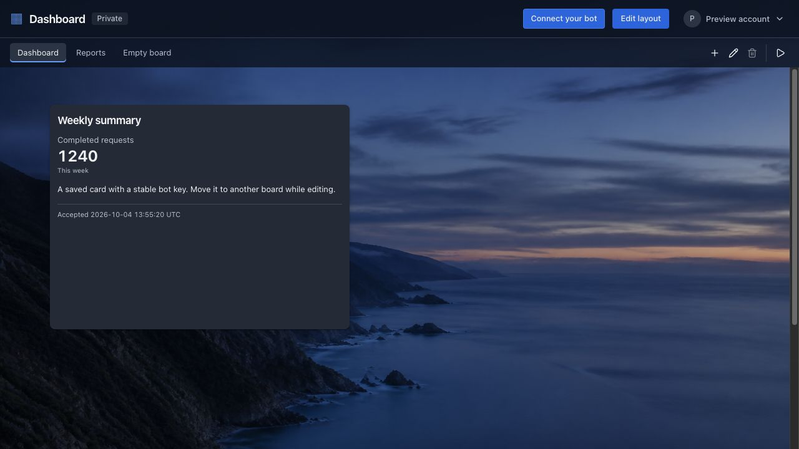
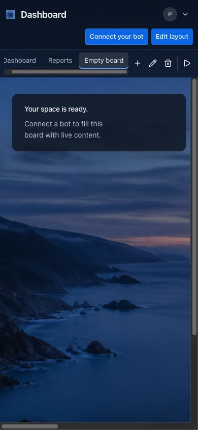
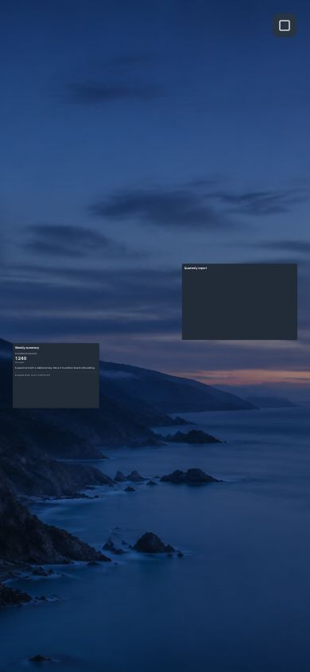

# Multiple boards acceptance evidence

Baseline is origin/main at 58dee3e. Build, lint, and typecheck passed before implementation. The existing image lint warning remains. The baseline had no board pages or board API.

All test data uses disposable SQLite databases and synthetic signed sessions. No production database, OAuth settings, or user data was changed. The user's existing port 11000 server remains intact. Local runs use Node 26 on macOS. The PR workflow runs the same checks on Node 22 on Linux.

## Acceptance matrix

| Area | Acceptance | Evidence | Result |
| --- | --- | --- | --- |
| Migration | Existing user/card/token IDs, payloads, geometry, revisions, and encrypted tokens preserved | `npm run test:boards:migration` deploys the historical schema, inserts records, deploys the new migration, and compares legacy fields | VERIFIED |
| Persistence | Required membership and database ownership consistency | Migration fixture checks required membership, rejects a cross-owner FK update, and passes `foreign_key_check` | VERIFIED |
| Boards | Original provision converges for existing/new/local accounts and stays renameable but undeletable | Migration, API suite concurrent first access, local bot-smoke, rename and deletion guards | VERIFIED |
| Boards | Create/rename/delete, normalized unique names, account isolation | `npm run test:boards:api` exercises real authenticated HTTP requests and foreign-account responses | VERIFIED |
| URLs | Stable opaque URLs, root redirect, rename/reload/sign-in/back-forward | API callback-path checks and board browser navigation. Separate secretless build verifies runtime signed root redirect | VERIFIED callback paths; real Google login not exercised |
| Transfers | Atomic authorized transfer, placement, preserved identity/content/size/key | API suite compares source/destination records and payloads | VERIFIED |
| Transfers | Completed retries unchanged; conflicts/full destination leave card unchanged | API suite covers retry, deleted source, competing transfers, and capacity rollback | VERIFIED |
| Transfers | Concurrent bot updates retained and stale source geometry/delete rejected | API suite races move with bot PUT and checks stale A-to-B-to-A revision requests | VERIFIED |
| Bots | Authenticated name/ID discovery, missing-board clarification | API suite bearer/session isolation and filters; bot-contract and instruction bundle checks | VERIFIED |
| Bots | Initial target/default original; moved key updates actual board after former board deletion | API suite checks continued PUT updates, invalid/deleted hints, identity, and owner-wide key count | VERIFIED |
| UI | Accessible scrollable creation-order tabs and deletion confirmation | Board browser CRUD, keyboard, and mobile checks. Future-clock API regression proves deterministic order | VERIFIED |
| UI | Edit-only dropdown removes transferred card and gives a destination link | Browser transfers a card, checks source removal/link/destination, and queues Remove during the held transfer | VERIFIED |
| Playback | Selected board first, captured order, 15-second dwell, loops, empty/single boards | Virtual-clock browser checks exact dwell, creation-order cycle, empty boards, and no single-board self-transition | VERIFIED |
| Playback | Play blocked during gestures/queued mutations, exits editing, hides bars/account | Browser holds scoped PATCH, performs a drag, checks Play state, then starts playback and checks controls | VERIFIED |
| Playback | Fullscreen requested in click, fallback, persistent host | Browser checks synchronous request and rejection fallback. Root IAB observes real `document.fullscreenElement` across automatic board changes | VERIFIED; native fullscreen checked manually |
| Playback | Bounds centered with padding, scale at most one, geometry unchanged, resize/data refit | Browser resizes the viewport, updates a bot card, checks fitted rectangles, and compares persisted geometry. Mobile IAB inspection | VERIFIED |
| Playback | Prefetch, hold current until ready, 300 ms slide, new dwell, reduced motion | Browser holds target beyond the deadline, checks waiting/current retention, releases it, and checks transition/new dwell. Reduced-motion run skips slide | VERIFIED |
| Playback | Automatic advances replace URL without history growth | Browser compares canonical paths and `history.length` during advances | VERIFIED |
| Playback | Stop initially visible, activity reveals it, focused Stop stays visible | Exact timer, pointer/focus checks, bubbling wheel/touch events. Root IAB also observes native wheel reveal | VERIFIED; touch and clock-driven wheel events are synthetic |
| Playback | Shield captures card/map input, Stop unscaled, interactions restored | Real iframe hit-testing, restored iframe point after scrolling, and mobile Stop inspection | VERIFIED |
| Playback | Stop/Escape/fullscreen exit restore last fully displayed board and focus Play | Browser tests Stop/Escape and repeated runs. Root IAB calls native `document.exitFullscreen` and observes restored board/Play focus | VERIFIED; native exit checked manually |
| Playback | Hidden pause, deleted-board skip, loading errors, cancellation | Browser checks hidden dwell/slide, deleted preloaded target, load error, and held late responses after Stop/hard navigation | VERIFIED |
| Rendered UI | Desktop and mobile inspection | Root IAB 1280x720 desktop and 390x844 mobile screenshots below; acceptance author also inspects browser screenshots | VERIFIED |
| Checks | Lint/typecheck/build/smoke/bot-contract/bot-smoke/deterministic browser | Commands below and CI workflow | VERIFIED locally; CI status is on the PR |

## Run the checks

```sh
npm run build
npm run lint
npm run typecheck
npm run test:boards:migration
npm run test:smoke
npm run test:boards:api
node_modules/.bin/tsx scripts/bot-contract.ts
node_modules/.bin/tsx scripts/bot-smoke.ts
npm run test:e2e
npm run test:e2e:boards
```

The browser commands build and start isolated production servers. Run them sequentially in a worktree because they share its generated build. Browser screenshots and the existing deterministic report are under `.e2e/`. Each command removes its temporary server and database.

## Resolved defects

| ID | Observed failure | Fix and regression |
| --- | --- | --- |
| B1 | A build without an auth secret cached the root login redirect | Request-time `connection()`; secretless build and runtime signed redirect checked |
| B2 | A held metadata response reverted a successful rename | Metadata version and pending-mutation fence; browser held-response and rename/Play/Stop checks |
| B3 | Equal creation timestamps sorted random opaque IDs | Transaction assigns an increasing account timestamp; API fixture advances the old timestamp beyond the wall clock |
| B4 | Wheel over Stop did not extend control visibility | Handler moved to the full stage; red and green bubbling-event regression |
| B5 | Queued Remove after transfer left Saving and Play disabled | Missing-card check precedes mutation state; held-transfer browser regression verifies destination survives and Play returns |
| B6 | A board deleted in another tab kept rendering after the workspace poll | Missing active membership redirects to the original board; real API deletion and browser URL/content regression |
| B7 | A full destination board reported that the source card had moved | Surface the server error; real 409 capacity response, actionable UI diagnosis, and source membership regression |
| B8 | Switching boards discarded queued keyboard edits | Board tabs, board CRUD, and destination links stay inert during saves; held first PATCH with three keyboard edits verifies all three requests and final position before navigation resumes |

The initial restored-map test selected an iframe point below the viewport. Scrolling the iframe into view fixed the observation. The same hit-test assertion remains. Native wheel events did not dispatch under the paused Playwright clock, so event-wiring checks use bubbling events; root separately verified native wheel input in IAB.

Backend and UI implementation used separate worktrees. The acceptance author reviewed the contract independently, reproduced defects before fixes, and released test-only commits. Root reviewed the integrated code and reran checks. A fresh fourth implementation reviewer could not start because the agent thread limit was reached. Review therefore combines the independent acceptance audit, root review, and the PR review.

The comment audit removed two internal narration comments and found no added lint or TypeScript suppressions. No constraint encoding or unresolved comment finding remains.

## Rendered screenshots

These images contain synthetic preview content. Normal view retains its scrollable canvas; presentation fits the occupied card bounds.







## Verification boundaries

Google OAuth was not completed with a real account. Callback path preservation and signed-session access were verified separately. Native fullscreen activation and exit were inspected in IAB; the deterministic suite tests request timing and rejection fallback. Production deployment and the production migration are outside this PR run.
